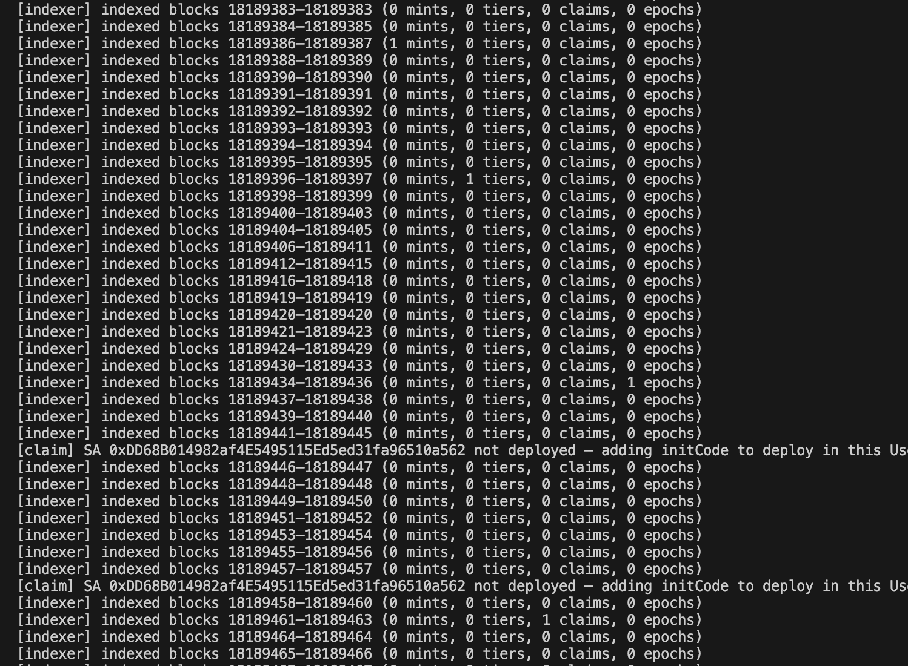
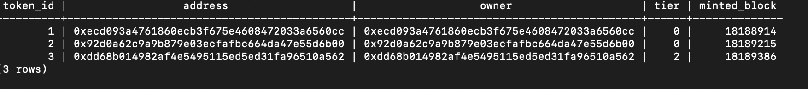
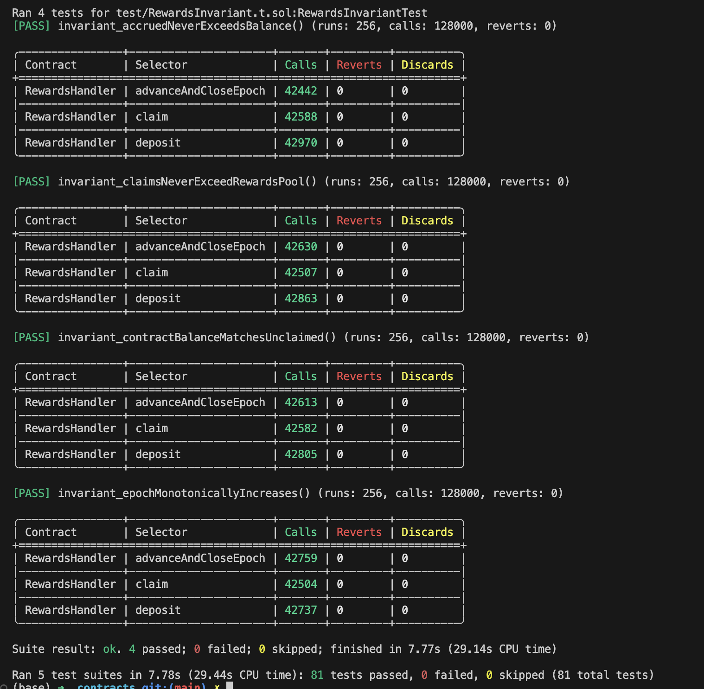
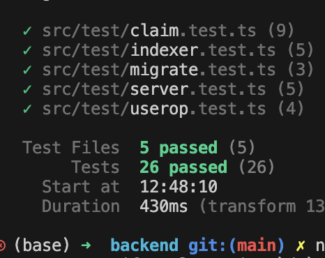

# Project Findings

## Transaction & Testing Notes

Two things I wanted to tell you:

1. I haven't done anything related to Tenderly; it was pretty new to me. I have tested `mint`, `tier`, `close`, `reputation`, `claim`, `deposit`, and every other function on the Scroll Sepolia network. Pretty sure it will work on mainnet too.
2. I have changed the epoch window to **5 minutes** instead of **7 days** so you can also test it easily. My Solidity tests are passing with the 7-day window as well.

### Loom Video

- [Transaction Demo Video](https://www.loom.com/share/88e20d469b1f4b87972e488aeb693a95)

> Forgot to give full window access in the video, so when I was talking about the backend catching events, it was still showing the website. Sorry — attached the screenshot of the backend catching events below.

### Local Setup

You have to run the backend locally to see the events being caught, plus Postgres.

```bash
npm i && cd backend && npm run dev
```

> Trying to deploy to Vercel is giving some IP-whitelisting errors (IPv6 / IPv4 related), but I fixed it and am still having some issues.

### Live Link

- **Frontend:** [https://we-see-frontend.vercel.app/](https://we-see-frontend-git-main-dengresarthak420-gmailcoms-projects.vercel.app/)
  > Events are currently being caught on the locally-run backend.

### Demo Account

If you want to play around, I made a demo account with all the permissions. Try minting for another wallet, changing tier, and claiming.

- **Address:** `0x0F2a7B637Cffd69C1142666bCf3671F3304Ee0D0`
- **Private Key:** `0x14dc9545564436e346aa4276575caf9b0607ff0ed2a6e33c842d305053f3fc55`

### Transaction Links

- **Minting:** [Scroll Sepolia TX](https://sepolia.scrollscan.com/op/0x74dc10dbd4d4e8b391afe358ce5e9afa728956abfc4f3cb0f20e5f99db179b35)
- **Claiming:** [Scroll Sepolia TX](https://sepolia.scrollscan.com/op/0xded40ed63564f029635653c7a95d1186dff50cb75828d550abdfef052b7a49b1)

### Token Notes

- **tokenId 1** — minted and claimed on V1
- **tokenId 2 and 3** — minted and claimed on V2 (preserving everything)

- **Note:** If you want to deposit rewards, demo wallet have tokens use these commands in contracts folder. 

#### 1. Grant DEPOSITOR_ROLE on the new RewardsDistributor to the admin EOA ( already given )
cast send 0x12fD4F2252FbDB9A56C5Ed85A305B13Bc2370D01 \
  "grantRole(bytes32,address)" \
  0x8f4f2da22e8ac8f11e15f9fc141cddbb5deea8800186560abb6e68c5496619a9 \
  0x0F2a7B637Cffd69C1142666bCf3671F3304Ee0D0 \
  --rpc-url https://sepolia-rpc.scroll.io/ \
  --private-key 0x14dc9545564436e346aa4276575caf9b0607ff0ed2a6e33c842d305053f3fc55

#### 2. Approve the new RewardsDistributor to spend reward tokens from admin wallet
cast send 0x260D994073378154A773f4dE3f26652F854cdFfd \
  "approve(address,uint256)" \
  0x12fD4F2252FbDB9A56C5Ed85A305B13Bc2370D01 \
  10000000000000000000 \
  --rpc-url https://sepolia-rpc.scroll.io/ \
  --private-key 0x14dc9545564436e346aa4276575caf9b0607ff0ed2a6e33c842d305053f3fc55

#### 3. Deposit 10 reward tokens into the new RewardsDistributor from admin wallet
cast send 0x12fD4F2252FbDB9A56C5Ed85A305B13Bc2370D01 \
  "deposit(uint256)" \
  10000000000000000000 \
  --rpc-url https://sepolia-rpc.scroll.io/ \
  --private-key 0x14dc9545564436e346aa4276575caf9b0607ff0ed2a6e33c842d305053f3fc55

**Flow:** `First mint → tier → epoch → claim` (3rd, 11, 21, last 3rd)

### Screenshots



**Database Entry**



**Forge Test**



**Backend Test**



---

## Severity Legend

| Severity | Description |
|----------|-------------|
| **Critical** | Questions the protocol's core functionality |
| **High** | Makes the protocol not work as expected |
| **Medium** | Makes the protocol not work as expected but can be worked around |
| **Low** | Nice to have but not medium priority |

---

## Contracts

### RewardDistribution

- `uint256 userShare = (tierAlloc * reputationOf[tokenId]) / tierTotal;` — Changed to floor — **Critical**
- Fixed calculation mismatch to `1000` and added `validateTreasury` split — **High**
- Fixed `closeEpoch` function — added `onlyRole` and a check for 7 days — **High**
- Added checks for duplicate `tokenId`s, removing trust in `EPOCH_CLOSER_ROLE` (design drawback) — **Medium**
- Should change `config_role` to add a `reputation_role` which can change reputation — **Low**
- Design options:
  1. Add a separate function for validating BPS, or
  2. Ask for all 4 tiers from the user (not very user-friendly, so skipping this) — **Low**
- `tierBpsSnapshot` for adding snapshot — **Low**

### MembershipSBT.sol

- Removed `UUPSUpgradeableInit` as it was removed from v5 — **Critical**
- Added `safeTransferFrom` to fully restrict transfers — **Critical**

### MembershipSBTv2.sol

- Removed `UUPSUpgradeableInit` as it was removed from v5 — **Critical**
- Improved the ordering of variables to prevent storage corruption — **Critical**
- Added distributor role in `initializeV2` for `markedClaim` — **Critical**
- Improved revoke function for re-minting — depends on protocol — **Critical/High**

---

## Backend

- **Reorg safety:** Store `block_number` and `block_hash` in cursor; verify hash before each tick; rewind on reorg; wrap entire tick in DB transaction so crash mid-tick rolls back — no partial state — **Critical**
- **Fixed known race:** Previously events written outside a transaction caused reputation to inflate by `+10` on every restart when claim insert was skipped by `ON CONFLICT` but the `UPDATE` still ran — **High**
- **Handled chicken-egg problem in `claim.ts`:** Added `claimDigest()` helper, signature verification via `verifyMessage` against smart-account `owner()`, and fixed membership query to check `LOWER(address) = LOWER($2)` — **Critical**
- **`indexer.ts`:** `onClaim` fetches `reputationOf(tokenId, { blockTag: blockNumber })` at exact claim block and stores it in `reputation_snapshot`; falls back to `"0"` if node doesn't support archive calls — **High**
- **`server.ts`:** Added Zod `ClaimReqSchema` (validates address format, `tokenId`/`epoch` presence, signature prefix); validates before `handleClaim`; returns `400` on bad input — **High**
- **`migrations/004_fix_reputation_snapshot.sql`:** Adds `reputation_snapshot` with `IF NOT EXISTS DEFAULT 0` (safe on empty and populated DBs); adds unique index on `tier_history(token_id, tx_hash)` for idempotent inserts — **High**
- **`indexer.ts`:** Added `REORG_BUFFER = 1`; indexer targets `head - 1` as safe ceiling, never raw tip (raise to `12+` for mainnet) — **Medium**
- **`indexer.ts`:** `onTierChange` now also inserts into `tier_history` (idempotent via unique index in migration `004`) — **Medium**
- **`indexer.ts`:** Added `reputationOf` to `REWARDS_ABI` so contract can be called for reads — **Medium**
- **`claim.ts` / `server.ts`:** Fixed membership query to use `LOWER(address)` comparison for case-insensitive matching — **Medium**
- **`indexer.ts`:** Exported `SBT_ABI` and `REWARDS_ABI` so `server.ts` can share definitions without duplication — **Low**
- **`userop.ts`:** Added `keccak256` to ethers named import, removed `keccak()` wrapper that used CommonJS `require` — **Low**
- **`tenderly.ts`:** Removed `import fetch from "node-fetch"`; Node 20's global `fetch` is used automatically — **Low**
- **`server.ts`:** Imports `SBT_ABI`/`REWARDS_ABI` from `indexer` instead of duplicating them — **Low**

